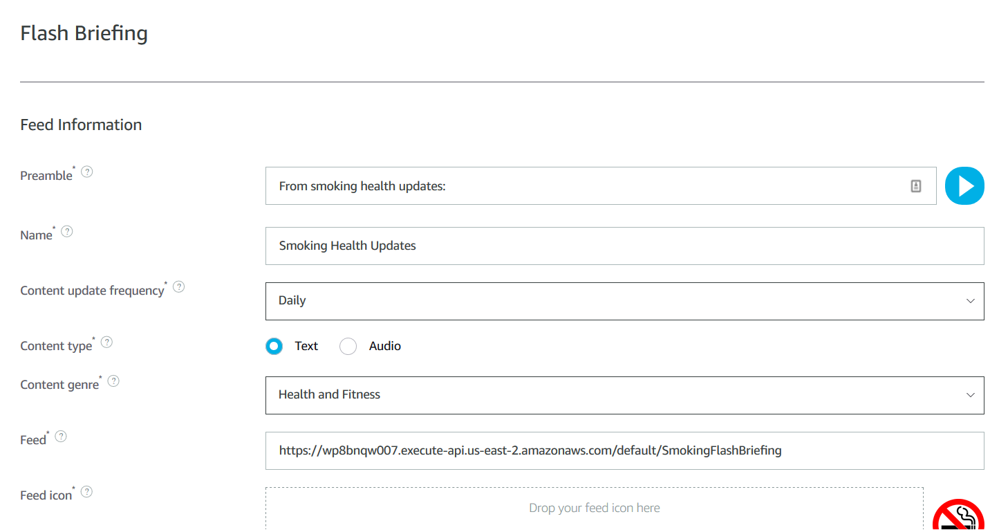

## Smoking Health Update Flash Briefing Demo

This is a demo Alexa Flash Briefing skill set up with AWS Lambda and some random strings.

### The Alexa Skill

The Alexa skill was created as a flash briefing with a news feed url pointing at [https://wp8bnqw007.execute-api.us-east-2.amazonaws.com/default/SmokingFlashBriefing](https://wp8bnqw007.execute-api.us-east-2.amazonaws.com/default/SmokingFlashBriefing).

### The Backend

There is a simple AWS Lambda powered backend which fakes a news feed available in the [backend](backend) folder.